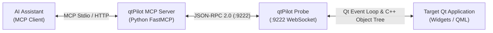

<!-- promptlib:start -->
# AGENTS.md - Guidelines for AI Coding Agents

## Project Architecture & Dual Delivery Model

qtPilot is a Qt-based Model Context Protocol (MCP) server enabling AI assistants to introspect and control Qt applications.

- **Desktop (Windows, Linux, macOS):** Dynamic probe injection (`.dll`, `.so`, `.dylib`) via `qtPilot-launcher` (`DYLD_INSERT_LIBRARIES`, `LD_PRELOAD`, Detours). No source code modification needed.
- **Mobile (Android, iOS):** Static probe linking (`libqtPilot-probe.a`) via CMake `find_package(qtPilot)` and `qtPilot_inject_probe(myapp)` / `target_link_libraries(myapp PRIVATE qtPilot::Probe)`. Built with `qt-cmake`.
- **Security Rule:** The probe opens an unauthenticated WebSocket server (`:9222`). On mobile, it MUST only be linked behind a development-only build flag and NEVER in a distributed release build.
- **Whole-Archive Linking:** Static probe startup relies on `Q_COREAPP_STARTUP_FUNCTION` static initialization. When linking by raw path instead of the CMake imported target, whole-archive force-loading (`-force_load`, `/WHOLEARCHIVE:`, `--whole-archive`) or `qtPilot::ensureInitialized()` is required.
- **LAN & Cross-Machine Driving:** LAN functionality and broadcast discovery (`src/probe/transport/bind_policy.h`) are first-class, mandatory requirements. The WebSocket server defends against browser Cross-Site WebSocket Hijacking (CSWSH) via Origin inspection while keeping non-browser LAN/CLI/MCP drivers 100% functional.

## Engineering & Validation Standards

- **Strict Red/Green TDD:** All assertions and features must be validated with proven, executable tests in a verifiable red/green cycle. Tests must fail before implementation and pass cleanly after. Never write untested assertions or unverified claims.
- **C++23 Standard & Monadic Composition:**
  - The probe, launcher, and test harness target **C++23** (`CMAKE_CXX_STANDARD 23`).
  - Use modern C++23 `<expected>` (`std::expected`, `std::unexpected`) and monadic operations (`.and_then()`, `.transform()`, `.transform_error()`, `.or_else()`) for fallible pipelines rather than unchecked exception leakage or null pointers.
- **Python Typing & Best Practices (Python 3.11+ / 3.14):**
  - Always include `from __future__ import annotations` at the top of every module.
  - Full, explicit type annotations on all function signatures (parameters and return types). Avoid bare `Any` wherever concrete types can be expressed.
  - Use modern built-in generic syntax: `list[T]`, `dict[K, V]`, `set[T]`, `tuple[T, ...]`, and union syntax `T | None` / `T | U` (never `typing.Optional` / `typing.Union` / `typing.List`).
- **Domain Modeling with Data Classes:**
  - Prefer `@dataclass(frozen=True)` (or `slots=True` where appropriate) over unstructured dictionaries or loose tuples for domain objects, records, and configs.
- **Monadic Result Pipelines & Functional Composition:**
  - Use `Result[T, E]` (`Ok` / `Err`) for multi-step pipelines and fallible operations where failures should be modeled explicitly without untyped exception leakage.
  - Leverage `map`, `map_err`, `flat_map`, `fold`, and `Result.from_callable()` for composable error handling and deterministic transformations.
- **Fluent Test DSL & Matchers:**
  - Utilize expressive fluent matchers (`expect_replay(result).to_pass()`, `expect_replay(result).to_diverge_at(...)`) and custom domain matchers (e.g., Google Mock `QEXPECT_THAT` / `qt_matchers.h`) to keep test assertions clear, robust, and readable.
- **Zero Warnings Policy:** Zero compiler warnings across all C++ compilers and zero pytest warnings/errors (`filterwarnings = ["error"]`).
- **Strict Confidentiality Rule (MANDATORY):** Driven applications must NEVER be named or identified in commits, PR descriptions, test fixtures, or docs. Always describe strictly by shape (e.g. "large widgets + QGraphicsView desktop app", "CAD-style plan view", "design-system gallery app"). Never commit proprietary product names, internal team/project codenames, private tracker issue keys (e.g. `ABC-1234`), customer URLs, or real UI screenshots.

## Build System & Commands

### Prerequisites

- **CMake 3.16+**
- **Qt 5.15+ or Qt 6.5+** (macOS requires Qt 6.5+; see [docs/MACOS.md](docs/MACOS.md))
- **C++23 compiler** (GCC 13+, Clang 17+, MSVC 2022+)

### Core Build Commands

```bash
# Desktop configure + build (specify QTPILOT_QT_DIR if Qt is not in system PATH)
cmake -B build -DQTPILOT_QT_DIR=/path/to/Qt/6.8.0/gcc_64
cmake --build build --config Release

# Android (cross-compile static probe using Qt's qt-cmake wrapper)
/path/to/Qt/6.11.1/android_arm64_v8a/bin/qt-cmake -B build-android -S . -DCMAKE_BUILD_TYPE=Release
cmake --build build-android

# iOS device (cross-compile static probe using Xcode generator)
/path/to/Qt/6.11.1/ios/bin/qt-cmake -B build-ios -S . -G Xcode
cmake --build build-ios --config Debug -- -sdk iphoneos

# Static probe on desktop (Linux/macOS only)
cmake -B build-static -DQTPILOT_PROBE_STATIC=ON -DCMAKE_PREFIX_PATH=/path/to/Qt
cmake --build build-static
```

### Sanitizers & Benchmarks

```bash
# Sanitizer builds (Linux/macOS)
cmake --preset asan-ubsan && cmake --build --preset asan-ubsan && ctest --preset asan-ubsan
cmake --preset tsan       && cmake --build --preset tsan       && ctest --preset tsan

# Complexity benchmarks (ID generation, tree serialization, resolution Big-O)
cmake -B build -DQTPILOT_BUILD_BENCHMARKS=ON
cmake --build build --target qtPilot_bench_object_id
./build/bin/qtPilot_bench_object_id --benchmark_min_time=0.05s
```

## Running Tests

### Linux

```bash
QT_DIR=$(grep "QTPILOT_QT_DIR:PATH=" build/CMakeCache.txt | cut -d= -f2)
QT_PLUGIN_PATH="${QT_DIR}/plugins" LD_LIBRARY_PATH="${QT_DIR}/lib" ctest --test-dir build -C Release --output-on-failure
```

### macOS

macOS requires `DYLD_FRAMEWORK_PATH` pointing to Qt `lib/`, `QT_QPA_PLATFORM=minimal`, and `QT_STYLE_OVERRIDE=Fusion` (Fusion avoids AppKit NSView crashes in headless mode):

```bash
QT_DIR=$(grep "QTPILOT_QT_DIR:PATH=" build/CMakeCache.txt | cut -d= -f2)
DYLD_FRAMEWORK_PATH="${QT_DIR}/lib" QT_PLUGIN_PATH="${QT_DIR}/plugins" \
  QT_QPA_PLATFORM=minimal QTPILOT_ENABLED=0 \
  ctest --test-dir build -C Release --output-on-failure
```

### Windows

On Windows, child processes spawned by ctest require `bin/` on `PATH` and `plugins/` as `QT_PLUGIN_PATH`:

```bash
# Git Bash:
QT_DIR=$(grep "QTPILOT_QT_DIR:PATH=" build/CMakeCache.txt | cut -d= -f2)
cmd //c "set PATH=${QT_DIR}\bin;%PATH% && set QT_PLUGIN_PATH=${QT_DIR}\plugins && ctest --test-dir build -C Release --output-on-failure"

# Native cmd.exe:
for /f "tokens=2 delims==" %Q in ('findstr "QTPILOT_QT_DIR:PATH=" build\CMakeCache.txt') do set QT_DIR=%Q
set PATH=%QT_DIR%\bin;%PATH%
set QT_PLUGIN_PATH=%QT_DIR%\plugins
ctest --test-dir build -C Release --output-on-failure
```

### Python Test Suite

```bash
uv run pytest python/tests
```

## Development Conventions

### C++ Code Style

- **Naming:**
  - Classes / structs / enums / type aliases: `PascalCase` (`McpServer`, `RequestHandler`)
  - Enum constants: `PascalCase` (`MatchMode::StartsWith`)
  - Functions / Methods: `camelCase` (`handleRequest`, `parseMessage`)
  - Locals and parameters: `camelCase` (`siblingBase`, `objectName`)
  - Member variables: `m_` prefix with `camelCase` (`m_serverPort`). Public fields of POD structs take no prefix (`QmlItemInfo::qmlId`)
  - Compile-time constants: `k` prefix with `PascalCase` (`kMaxEffectiveDepth`, `kBroadcastIntervalMs`). `UPPER_SNAKE_CASE` is for macros only.
  - File- and function-scope statics: `g_` for globals, `s_` for statics (`s_numericIds`)
  - Namespaces: `camelCase` (`qtPilot`)
- **Qt Guidelines:**
  - Prefer `QString` over `std::string` for Qt integration boundaries.
  - Rely on `QObject` parent-child tree ownership for widgets and lifecycle management. Use `deleteLater()` for cross-thread or slot-originated object teardown.
  - Include guards: `#pragma once`.

## Using qtPilot Tools (MCP Integration)

When qtPilot is configured as an MCP server (see `.mcp.json`), AI assistants can inspect and control running Qt applications:



### 1. Launch Target App

- **Desktop (Injected):**

  ```bash
  build/bin/Release/qtPilot-launcher build/bin/Release/qtPilot-test-app
  ```

- **Mobile (Linked):**

  ```bash
  # Android port forward:
  adb forward tcp:9222 tcp:9222
  # iOS port forward:
  iproxy 9222 9222
  ```

### 2. Connect & Discover

```python
qtpilot_status()                          # Session snapshot (active mode, connection, probes)
qtpilot_connect_probe(ws_url="ws://...")  # Connect to probe (or ws://localhost:9222)
qt_ping()                                 # Check liveness
```

### 3. Core Automation Tools

- **Object Discovery:** `qt_objects_search(objectName="...", className="...", properties={...})`
- **Inspection:** `qt_objects_inspect(objectId="...", parts=["info", "properties", "methods", "signals", "geometry", "model"])`
- **Property Access:** `qt_properties_get(objectId="...", name="text")` / `qt_properties_set(objectId="...", name="text", value="...")`
- **UI Interaction:** `qt_ui_click(objectId="...")`, `qt_ui_sendKeys(objectId="...", text="Ada")`, `qt_ui_screenshot(objectId="...", fullWindow=True)`
- **Item Views & Models:** `qt_models_list()`, `qt_models_data(objectId="...", role="display")`, `qt_models_search(objectId="...", text="SearchTerm")`
- **Deterministic Replay:** `qtpilot replay <recording.jsonl> --target <app> --record <new_baseline.jsonl>`

## Key References & Documentation

- [docs/REPLAY.md](docs/REPLAY.md) - Deterministic replay engine, normalization, and divergence detection.
- [docs/MOBILE.md](docs/MOBILE.md) - Android and iOS static probe linking, CMake integration, and USB port forwarding.
- [docs/BUILDING.md](docs/BUILDING.md) - CMake presets, multi-compiler support, and static build options.
- [docs/SANITIZERS.md](docs/SANITIZERS.md) - ASan/UBSan and TSan configuration and runtime diagnostics.
<!-- promptlib:end -->
