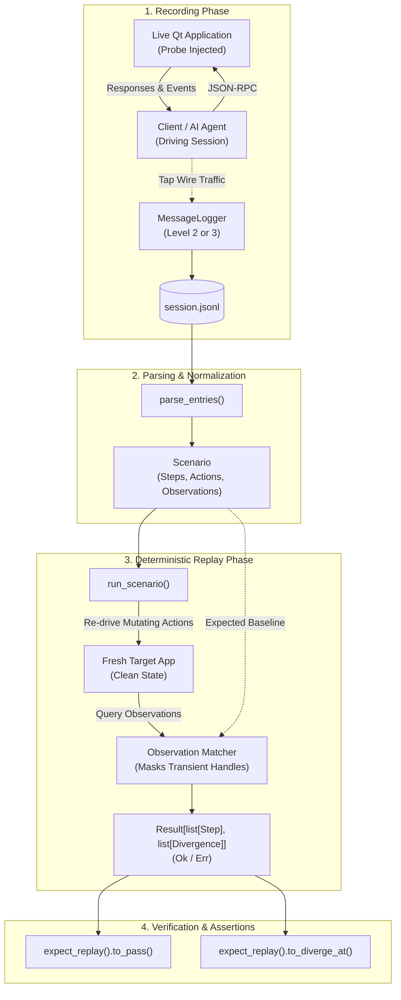

# Deterministic Replay

A message log written by `qtpilot_log_start` is a transcript. Replay turns one into a test:
re-drive what was driven, re-observe what was observed, and report what changed.

## Why this works

A session divides cleanly into mutating actions and observations. Mutating methods *change* the application:

- **Native Qt:** `qt.ui.click`, `qt.ui.doubleClick`, `qt.ui.clickItem`, `qt.ui.sendKeys`, `qt.properties.set`, `qt.methods.invoke`
- **Computer Use:** `cu.click`, `cu.rightClick`, `cu.middleClick`, `cu.doubleClick`, `cu.mouseMove`, `cu.drag`, `cu.mouseDown`, `cu.mouseUp`, `cu.type`, `cu.key`, `cu.scroll`, `cu.action`
- **Chrome Mode:** `chr.click`, `chr.formInput`, `chr.navigate`

Everything else only *observes* it. Re-driving the first kind against a fresh application and
comparing the second is an assertion about behaviour — and it needs no test written by hand for
each flow, because the recording already is one.

The observing set is an allow-list rather than "everything that is not mutating":

- **Native Qt:** `qt.objects.tree`, `qt.objects.inspect`, `qt.objects.search`, `qt.properties.get`, `qt.models.list`, `qt.models.data`, `qt.models.search`, `qt.ui.geometry`, `qt.ui.hitTest`
- **Computer Use:** `cu.cursorPosition`
- **Chrome Mode:** `chr.readPage`, `chr.getPageText`, `chr.find`, `chr.tabsContext`, `chr.readConsoleMessages`

`qt.ping` and `qt.version` describe the harness. The `qt.names.*` and `qt.signals.*` families
describe the session's own bookkeeping. `qt.ui.screenshot` returns image bytes that belong in a
visual golden. None of them say anything about the application under test, and asserting on them
would fail runs for reasons a reader cannot act on.



## Recording a scenario

```python
qtpilot_log_start(path="scenarios/submit-form.jsonl", level=2)
# ... drive the application ...
qtpilot_log_stop()
```

**Level 2 or above.** A level-1 log records tool names but no wire traffic, so there is nothing
to replay. Both the CLI and `qtpilot_replay_run` refuse such a log rather than running empty and
reporting success. Use **level 3** if the scenario should also assert on signal emissions.

**Separate recording from the replay baseline.** Stop
`qtpilot_recording_*` (and any explicit `qt_events_start` capture) before
starting `qtpilot_log_start`. A recording session enables lifecycle, signal,
and event instrumentation; a clean replay log should contain only the
notifications whose setup calls it also records. If you run the standalone
`qtpilot replay` CLI, disconnect the MCP client first because the probe accepts
one WebSocket client at a time.

**Register names first.** An object with no registered name is reported as `QObject~<counter>`,
and the counter follows the order objects happened to be constructed in. Replay masks it to
`QObject~*` so it does not fail every run, but that also means it cannot tell two unnamed objects
apart. `qt.names.register` / `qt.names.load` give a recording a stable identity, and are what
makes a scenario survive a refactor.

**Observe deliberately, or use a watch list.** A replay can only assert on what the recording
looked at, and an operator driving an application clicks far more readily than they inspect. A
session of nothing but clicks replays as a sequence of clicks that cannot fail.

Either inspect the things whose state is the point of the scenario while recording, or declare
them once in a watch list and let replay query them after every action:

```json
{
  "watch": [
    {"method": "qt.properties.get", "params": {"objectId": "statusBar.label", "name": "text"}},
    {"method": "qt.objects.inspect", "params": {"objectId": "resultsView"}}
  ]
}
```

```bash
qtpilot replay session.jsonl --watch watch.json --record -o golden.jsonl   # capture a baseline
qtpilot replay golden.jsonl                                               # check against it
```

A watch list may only name observing methods. It runs after every action, so letting it drive
input would silently rewrite the scenario it is supposed to be measuring.

A watch list is a **recording-time** input. Once captured, those observations are part of the
baseline, so replaying does not take `--watch` again -- passing it would query everything twice.
Recorded observations also keep their original positions, so adding a watch list to an existing
scenario cannot change what its baseline means.

## Running one

```bash
qtpilot replay scenarios/submit-form.jsonl                 # against ws://localhost:9222
qtpilot replay scenarios/submit-form.jsonl --inspect       # summarise, connect to nothing
qtpilot replay scenarios/submit-form.jsonl --settle 0.25   # slower async updates
qtpilot replay scenarios/submit-form.jsonl --json          # machine-readable report
```

The application must already be in the state the recording started from. **Replay drives input;
it does not reset anything.**

### Exit codes

| Code | Meaning |
| --- | --- |
| 0 | No divergence |
| 1 | Ran, and the application behaved differently |
| 2 | Could not run: missing or malformed log, nothing to drive, or no probe reachable |
| 3 | Aborted partway: an action raised an error so subsequent steps could not be tested |

The split matters in CI. A probe that is not there has not "behaved differently", and reporting
it as a divergence sends someone hunting a regression that does not exist. Similarly, an aborted
run (exit code 3) distinguishes an execution failure during replay from an application regression
(exit code 1).

Before a scenario can drive the application, each JSONL line must be an object
and every `res` or `err` entry must match both the request ID and method of an
earlier `req`. A truncated or corrupt transcript is rejected instead of being
reinterpreted as fresh UI input.

## What is ignored, and why

Five things differ between two runs of the same session and would otherwise fail every replay:

| Ignored | Reason |
| --- | --- |
| `ts`, `dur_ms`, and the probe's `meta.timestamp` | Timing. Stripped at every depth. |
| The JSON-RPC request `id` | A counter. Stripped at the **top level of an entry only** — a nested `id` names an *object*, and dropping it everywhere would leave a diff unable to tell one widget from another. |
| `QObject~<n>` handles | The counter follows construction order. Masked to `QObject~*`; register names for identity that matters. |
| Logger-truncated values (`...<truncated Nc>`, `<image:Nb>`) | The recording does not hold what the application returned, so comparing the placeholder would fail over a difference the logger introduced. Treated as wildcards. |
| Notification order within a step | Delivery order between independent objects is not promised. Compared as a multiset. |

Signals also arrive asynchronously, so a replay that asserted the instant a call returned would
report a race as a divergence. `--settle` (default 0.1s) is the window after each action; raise it
for an application that updates slowly.

## Failure handling

An error on an **observation** is recorded and the run continues — an object that no longer
exists is a finding worth reporting next to everything else that changed.

An error on an **action** aborts. Every later step assumes the earlier ones happened, so carrying
on would report a cascade of differences that are all the same failure.

## Using it from a test runner

`qtpilot replay` is a process that exits non-zero, so a scenario drops into ctest next to
ordinary tests:

```cmake
add_test(NAME Replay.SubmitForm
         COMMAND qtpilot replay ${CMAKE_CURRENT_SOURCE_DIR}/scenarios/submit-form.jsonl)
```

This complements unit tests and a full GUI-automation suite rather than replacing either. Unit
tests run without an application; a replay runs against a real one but is cheap to author,
because recording a session is the authoring step.

## Programmatic API, Monadic Results, and Fluent DSL

For programmatic execution in pytest or CI runners, use `run_scenario` with fluent matchers or monadic results:

```python
from qtpilot.connection import ProbeConnection
from qtpilot.fluent import expect_replay
from qtpilot.replay import parse_entries, run_scenario

scenario = parse_entries(entries)
result = await run_scenario(scenario, conn)

# Fluent assertions
expect_replay(result).to_pass()
expect_replay(result).to_diverge_at(step=2, kind="value_mismatch")

# Monadic Result pipeline
outcome = result.to_result()  # Result[list[Step], list[Divergence]]
outcome.map(lambda steps: print(f"Successfully replayed {len(steps)} steps!")) \
       .map_err(lambda errs: print(f"Found {len(errs)} divergences: {errs}"))
```

## Limits

- The recursive signal subscribe behind `qtpilot_recording_*` is still one level deep, so a
  recording can miss nested widgets. See `O8` in
  [observability-testability-gaps.md](observability-testability-gaps.md).
- There are no emission timestamps, so signals are ordered per step but not timed within one.
- Screenshots are excluded by design. Pair a replay with a visual golden if pixels matter.
