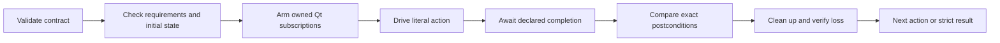

# Replay contracts and exploratory transcripts

`qtpilot replay` and `qtpilot_replay_run` default to strict version-2 JSON
contracts. A pass requires declared initial state, exact assertions, completion
evidence and known loss counters. Diagnostic JSONL transcripts need an explicit
`--exploratory` / `exploratory=True`; they never report `strict_passed: true`.

Replay drives an already running application. The caller prepares its fixture;
the fixture label does not execute reset code or shell commands. Disconnect any
other MCP client before using the CLI: a probe still has one active controller.
These changes do not alter the original unconfigured LAN bind, UDP discovery,
non-browser driving or independent Origin checks. See [authentication and
profiles](AUTHENTICATION.md) for optional authenticated LAN access.

## A strict contract

Save this as `scenarios/form.json`, replacing the object ID and values with the
prepared fixture's actual values. Assertions use probe wire methods, not MCP tool
names. Each step needs a postcondition, a signal checkpoint, or both.

```json
{
  "format": 2,
  "fixture": "prepared-form",
  "timeout": 2,
  "requirements": [
    {"name": "protocol", "method": "getVersion", "params": {},
     "path": ["protocolVersion"], "expected": 1}
  ],
  "preconditions": [
    {"name": "initial-name", "method": "qt.properties.get",
     "params": {"objectId": "form.nameEdit", "name": "text"},
     "path": ["result", "value"], "expected": "ready"}
  ],
  "steps": [
    {
      "name": "edit-name",
      "action": {"method": "qt.properties.set",
                 "params": {"objectId": "form.nameEdit", "name": "text", "value": "Ada"}},
      "checkpoint": {"objectId": "form.nameEdit", "signal": "textChanged",
                     "arguments": ["Ada"]},
      "postconditions": [
        {"name": "updated-name", "method": "qt.properties.get",
         "params": {"objectId": "form.nameEdit", "name": "text"},
         "path": ["result", "value"], "expected": "Ada"}
      ]
    }
  ]
}
```

```bash
qtpilot replay scenarios/form.json --inspect  # validate without connecting
qtpilot replay scenarios/form.json --json
qtpilot replay scenarios/form.json --ws-url wss://probe-host:9222 \
  --profile trusted-network --auth-token-file /private/path/token --tls-ca-file /private/path/ca.pem
```

MCP accepts `qtpilot_replay_run(path="scenarios/form.json")` or the same JSON
object as `contract=...`. Exactly one of `path`, `contract` or exploratory `steps`
is allowed. `qtpilot_replay_inspect` also defaults to strict format validation.

The parser rejects unknown/missing fields, unsupported formats/method categories,
duplicate JSON keys, non-finite numbers, empty readiness/action lists and actions
without completion assertions. `timeout` is a finite value greater than zero and
at most 300 seconds. Lists are limited to 1,000 entries; contract input and retained
raw evidence each have a 4 MiB budget. Exceeding the evidence budget fails instead
of truncating it. Requirements and preconditions use an observing-method allowlist;
actions use the native/Computer Use/Chrome mutating-method allowlist.

## What establishes a pass

1. Validate the complete contract before connecting or mutating the application.
2. Obtain known probe/controller loss counters with session identities; evaluate
   requirements and preconditions exactly. A failed initial state drives zero actions.
3. If declared, subscribe to target destruction and completion **before** the action.
   Establish a cursor that excludes prior buffered emissions, then drive literal
   action parameters without handle masking or normalization.
4. Await the declared signal, then sample postconditions once. Without a checkpoint,
   sample after the action response. There is no settling sleep or implicit retry.
5. Release owned subscriptions/handlers and check checkpoint and transport loss
   before proceeding. Unknown/reset counters, session changes or dropped evidence
   prevent a strict pass and stop subsequent actions.


```mermaid
flowchart LR
    Validate[Validate contract] --> Ready[Check requirements and initial state]
    Ready --> Arm[Arm owned Qt subscriptions]
    Arm --> Drive[Drive literal action]
    Drive --> Wait[Await declared completion]
    Wait --> Assert[Compare exact postconditions]
    Assert --> Clean[Clean up and verify loss]
    Clean --> Next[Next action or strict result]
```

The readiness phase and each step have an `asyncio.timeout` deadline. Cleanup has
a separate bounded unsubscribe deadline and runs on failure, timeout and task
cancellation. Qt owns signal connections, object lifetimes and delivery; Python
uses `asyncio.Queue` and `AsyncExitStack`. The checkpoint queue holds 256 emissions.
Native exclusive subscriptions have a 64-permit `QSemaphore` limit; each checkpoint
owns two. Existing ordinary subscriptions remain independent and are not removed
when a checkpoint finishes. Older probes that do not acknowledge exclusive
ownership or provide loss counters cannot certify strict acceptance.

Immediate and queued signals are supported. A checkpoint's optional `arguments`
matches the complete JSON argument array. Omit it to assert the signal occurrence
only. Include an application correlation value when causality matters: observing a
signal after an action does not prove that the action caused it. Qt values are
compared as serialized on the wire; this is not proof of native metatype fidelity.
Unsupported argument types may require an application-provided scalar completion
signal. A timeout does not interrupt a blocking Qt application handler or undo
an action already delivered.

## Evidence and failure reports

Strict reports retain raw observation responses, action responses and matched
checkpoint notifications. Each comparison includes the selected field `path`,
expected/actual values, evidence kind and match result. An empty path asserts the
entire response. A selected field explicitly narrows assertion scope; other fields
remain in `raw`. Timestamps, IDs and generated handles are never silently masked.
JSON types remain significant, including boolean versus number.

`evidence_counts` distinguishes `exact`, `normalized`, `wildcard`, `unavailable`
and `unsupported`, in units of assertions. A strict pass has only matching exact
assertions. Truncation/image placeholders, generated-handle wildcards, missing
fields, failed reads and unsupported-value markers cannot establish exactness.
`loss_before`/`loss_after` include probe/controller session counters;
`checkpoint_evidence` retains queue capacity, queued count and drops through cleanup.

`qtpilot_status` and `qtpilot://status` expose the same transport, diagnostic signal
waiter and event-capture counters. Unavailable transport counters are unknown, never
invented zeroes. Diagnostic signal counters cover their **waiter lifetime**, not an
inferred probe session; overflow and untracked-buffer eviction are separate counts.
Explicit forget/fresh operations intentionally discard data. Strict checkpoints
use their own owned buffers and do not rely on diagnostic waiter history.
Event capture defaults to 10,000 retained events, drops the oldest on overflow and
reports `buffer_dropped`/`buffer_capacity`; this is an event-count bound, not a byte bound.

| CLI exit | Strict meaning |
| --- | --- |
| 0 | Every declared action and exact assertion completed with verified loss evidence |
| 1 | Initial-state or postcondition comparison failed |
| 2 | Invalid input/options or connection preparation failed |
| 3 | Incomplete acceptance: requirement, action, checkpoint, cleanup or evidence failure |

`failure_kind`, `failed_step`, `reason` and `actions_driven` distinguish failures;
the action count includes attempted calls. Failed readiness never drives an action.
Python task cancellation propagates after cleanup instead of returning a pass.
There is no automatic baseline rewrite in strict mode.

## Pytest and fluent specifications

```python
from __future__ import annotations

from qtpilot.connection import ProbeConnection
from qtpilot.contract_runner import run_contract
from qtpilot.fluent import expect_contract_replay
from qtpilot.replay_contract import load_contract


async def verify_prepared_form(connection: ProbeConnection) -> None:
    contract = load_contract("scenarios/form.json").unwrap()
    result = await run_contract(contract, connection)
    (expect_contract_replay(result)
        .to_pass_strictly()
        .to_have_driven(1)
        .to_complete_checkpoint("edit-name")
        .to_have_no_evidence_loss())
```

Keep pytest fixtures, parametrization and assertion diagnostics as the foundation.
Use fluent assertions for domain outcomes, including
`.to_fail_as("precondition").to_have_driven(0)` and `.to_have_evidence(wildcard=1)`.
Parser/loading operations return the existing typed `Result`; contract/results are
frozen dataclasses. Tests include negative matcher diagnostics and native injected
Qt fixtures. [PySide qualification](PYSIDE-QUALIFICATION.md) remains partial;
Python Qt bindings are not a runtime dependency or the native acceptance backend.

## Migrating diagnostic recordings

The experimental JSONL formats are not strict contracts. Create a version-2 JSON
document with a prepared fixture, readiness assertions and completion evidence.
Do not convert normalized/truncated transcript values into supposedly exact
baselines. Inspect fresh raw values, choose stable object names and explicitly
select the fields that matter.

For diagnostic replay, opt in:

```bash
qtpilot replay session.jsonl --exploratory --inspect
qtpilot replay session.jsonl --exploratory --json
qtpilot replay session.jsonl --exploratory --settle 0.25
qtpilot replay session.jsonl --exploratory --watch watch.json --record -o diagnostic-baseline.jsonl
```

Record wire traffic with `qtpilot_log_start(path="session.jsonl", level=2)` and
stop with `qtpilot_log_stop()`. Level 3 includes notifications; level 1 lacks wire
actions and is rejected for replay. Watch files contain a `watch` list of observing
`method`/`params` objects. `--record` requires `--watch` and a separate `--output`;
an aborted run is not written as a partial baseline. Stop event recording before
capturing a replay transcript so session instrumentation is not accidentally mixed.

Exploratory mode retains handle/QML-type/timing normalization, truncated-value
wildcards and unordered notification comparison. Its default 0.1-second settle
delay is pacing, not completion evidence. Initial observations still gate actions;
required `qt.sync` errors stop execution unless `--no-sync` explicitly opts out.
Reports always set `mode: "exploratory"`, `strict_passed: false`,
`raw_available: false` and `loss_verified: false`. Category counts cover collected
observation/notification items, excluding actions and unexecuted observations;
unclassified recorded calls appear separately in `unsupported_calls`.
`run_scenario` / `expect_replay` remain the diagnostic Python API.

## Remaining limits

- Strict assertions prove declared wire values, not global application determinism,
  a transactional snapshot, or the absence of unrelated background work.
- General property/model watches, automatic fixture reset and mutation retry are
  outside this change. Source emission timestamps and causal tracing remain open.
- Recursive event-recording subscriptions still visit only one child level.
- Screenshots require separate visual comparisons; this contract does not certify pixels.
- Local tests and hosted cross-builds do not establish physical-device behavior or
  separate-host LAN acceptance. Follow the [LAN runbook](AUTHENTICATION.md).
